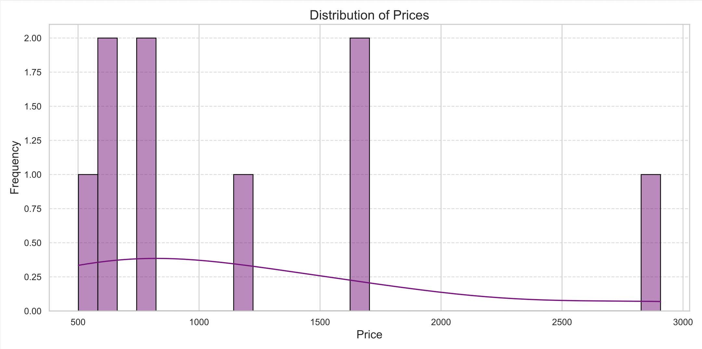

# Booking Data Analysis Report

This project is a data analysis script written in Python that processes booking data from a CSV file, performs cleaning, and generates a PDF report containing multiple visualizations. The report helps understand key trends and insights around customer bookings, pricing, and other related attributes.
<br><br><br>




---

## 📂 Project Structure

```
.
├── file.csv                  # Input booking data (replace with your CSV)
├── data_analysis.py         # Python script for data cleaning and visualization
├── data_analysis_report.pdf # Output: PDF report with plots
├── app.py                   # Streamlit app
└── README.md                # This file
```

---

## 📊 Features Comparison: PDF Report vs. Streamlit Dashboard

| Feature                    | PDF Report | Streamlit Dashboard     |
|---------------------------|------------|--------------------------|
| Bookings over time        | ✅         | ✅ + Interactivity       |
| Price distribution        | ✅         | ✅                       |
| Booking status            | ✅         | ✅                       |
| Travel purpose            | ✅         | ✅ + Filter              |
| Device usage              | ✅         | ✅                       |
| Room count analysis       | ✅         | ✅                       |
| Adults vs Price           | ✅         | ✅                       |
| Country-wise bookings     | ✅         | ✅ + Filter              |
| View raw data             | ❌         | ✅                       |
| User input (filters)      | ❌         | ✅                       |

---

## 🛠 Features

- Cleans and parses raw booking data, including:
  - Date fields (`Check-in`, `Check-out`, `Booked on`, `Cancellation date`)
  - Currency and numeric fields (`Price`, `Commission amount`)
  - Categorical values (`Status`, `Device`, etc.)
- Handles missing and malformed data
- Generates a **multi-page PDF** report with the following plots:
  1. Total bookings over time (monthly)
  2. Distribution of booking prices
  3. Bookings grouped by status
  4. Average price by travel purpose
  5. Bookings by device used
  6. Bookings by number of rooms
  7. Average price by number of adults
  8. Bookings by country

---

## 📊 Sample CSV Header (Input Format)

The input file is expected to have the following columns:

```
Book number, Booked by, Guest name(s), Check-in, Check-out, Booked on, Status, Rooms, Persons, Adults, Children, Children's age(s), Price, Commission %, Commission amount, Payment status, Payment method, Remarks, Booker group, Booker country, Travel purpose, Device, Unit type, Duration (nights), Cancellation date, Address, Phone number
```

Ensure column names and formats match this header, especially for date and numeric fields.

---

## 🚀 Getting Started

### Prerequisites

- Python 3.7+
- pandas
- matplotlib
- seaborn

Install dependencies:

```bash
pip install pandas matplotlib seaborn
```

### Usage

1. Replace `'file.csv'` in the script with the path to your own CSV file.
2. Run the script:

```bash
python data_analysis.py
```

3. A PDF named `data_analysis_report.pdf` will be generated in the same directory.

---

## 📈 Sample Output (PDF)

The generated PDF includes multiple graphs for a visual overview of your booking data trends. These can be useful for business reporting, customer behavior analysis, or operational planning.

---

## 📝 Notes

- Rows with missing `Price` or `Commission amount` are dropped during analysis.
- The script tries to coerce errors in date parsing and numeric conversion.
- Make sure your input data uses consistent formatting (e.g., `AUD` or `$` in price columns).

---

## 📌 To Do / Ideas for Improvement

- Add CLI support for easier file input
- Add more visualizations (e.g., heatmaps, time series trends)
- Automate the generation of monthly reports
- Integrate with a dashboard or web frontend

---

## 📬 Contact

For questions or suggestions, feel free to reach out or open an issue.

---